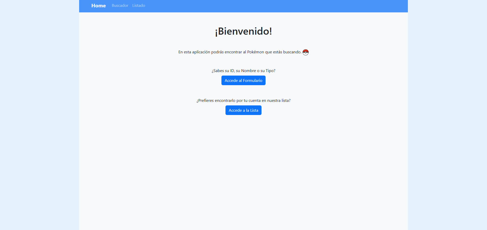
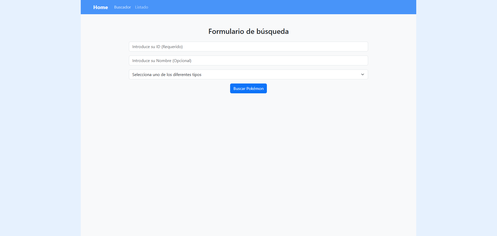
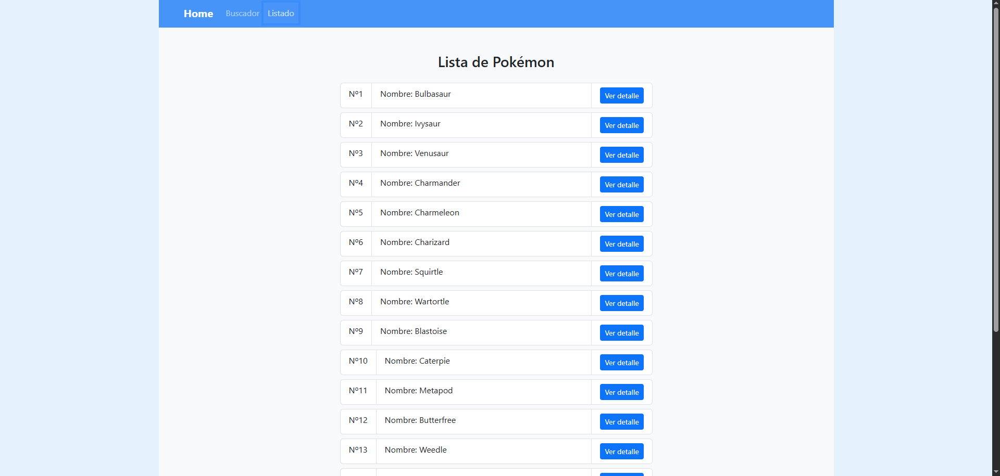
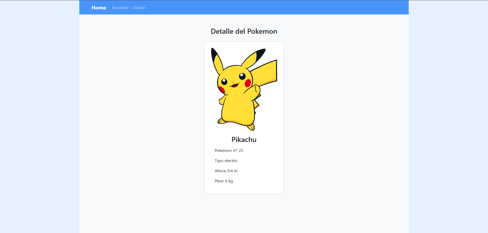
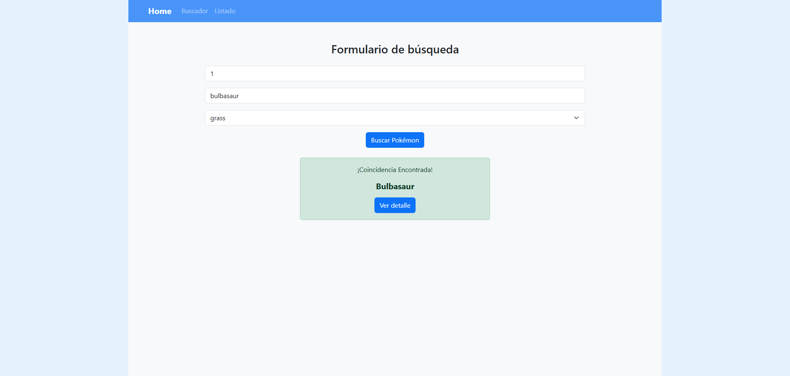
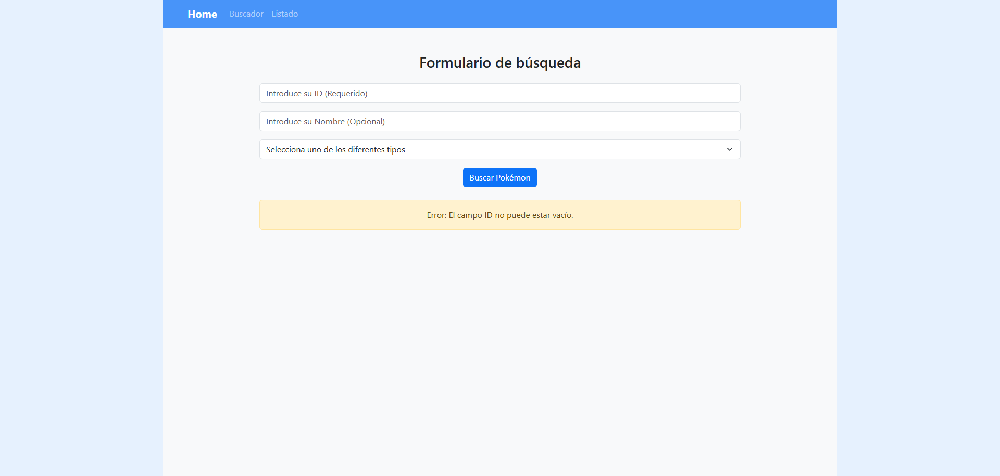
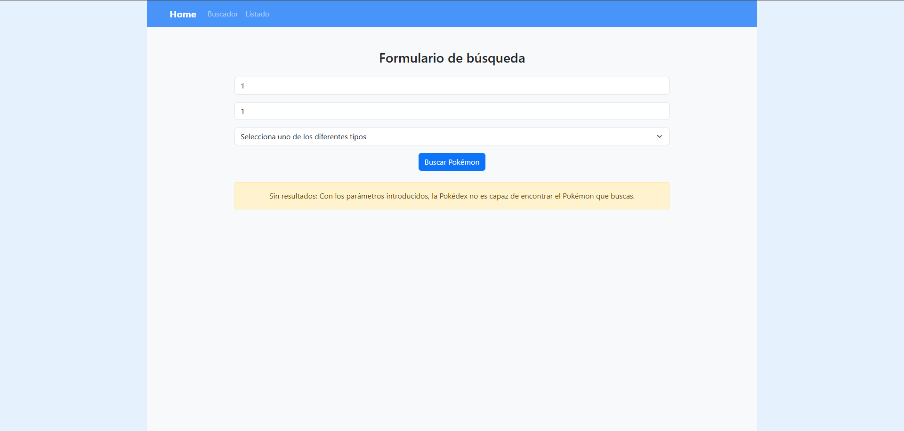
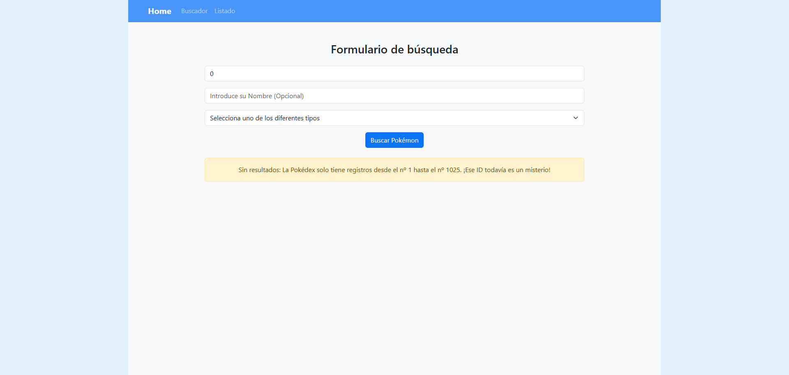

# 1. Propósito de la aplicación

Esta aplicación se conecta a una API pública ([PokeAPI](https://pokeapi.co/)) que proporciona una gran variedad de datos sobre el mundo Pokémon. La información se consume a través de diferentes endpoints (URLs) que devuelven los datos en formato JSON. 

El objetivo principal es ofrecer a los usuarios la posibilidad de buscar y explorar la información que deseen de múltiples formas, garantizando una experiencia de uso intuitiva y un diseño sencillo.

# 2. Componentes

1. **Página de Inicio (Home)** (`/home`): Pantalla principal con un mensaje de bienvenida y botones de acceso directo a las distintas secciones de la aplicación.
   

2. **Página de Buscador** (`/buscador`): Contiene un formulario para que el usuario pueda introducir y filtrar datos. Incluye validaciones y manejo de errores integrados.
   

3. **Página de Listado** (`/listado`): Muestra una lista dinámica generada mediante TypeScript que renderiza los datos obtenidos directamente de la API.
   

4. **Página de Detalle** (`/detalle/:id`): Muestra la información individual y detallada de cada Pokémon. No es accesible directamente desde el menú de navegación, sino al seleccionar un Pokémon específico.
   

5. **Página de Error** (`/error`): Ruta de captura a la que se redirige cuando ocurre un fallo. Se encarga de mostrar alertas visuales al usuario haciendo uso de la librería **SweetAlert**.
   

# 3. Enlaces de la API

Los endpoints principales utilizados en el proyecto son:

1. **Datos generales:** Para obtener el listado base de Pokémon (nombre y URL con los detalles individuales).
   - *Endpoint:* `https://pokeapi.co/api/v2/pokemon`
2. **Tipos de Pokémon:** Para cargar dinámicamente las opciones del menú desplegable en el Buscador.
   - *Endpoint:* `https://pokeapi.co/api/v2/type`

# 4. Tratamiento de coincidencias, errores y fallos de conexión

La aplicación está preparada para gestionar diferentes escenarios y guiar al usuario:

1. **Coincidencias en la búsqueda:** Resultados válidos al buscar un Pokémon en el Buscador.
   

2. **Error de campo vacío:** Alerta generada cuando se intenta buscar sin introducir un ID.
   

3. **Error de parámetros:** Alerta cuando los filtros o datos introducidos en el formulario no tienen un formato válido.
   

4. **Error de ID inexistente/no válido:** Aviso cuando el identificador proporcionado en el Buscador no corresponde a ningún Pokémon.
   

5. **Fallo de conexión:** Manejo del error que ocurre en los componentes si la petición a la API externa falla (por ejemplo, si la API está caída o no hay internet).
   

# 5. Link repositorio en GitHub
   ([Ejercicio-2-3-Trimestre_App-Pokemon](https://github.com/albertogarcia92/Ejercicio_App-Pokemon.git)).